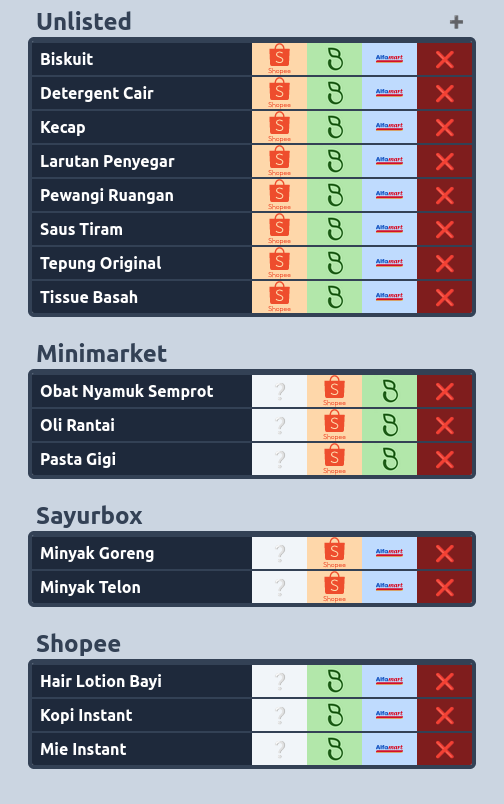

# Self Shopping List

Self Shopping List is a web application to manage your shopping list. You can add, delete and move items to different store category in one click.

## Demo

Check out the live demo at https://masrestu.github.io/self-shopping-list/

## Features

- Add item to your shopping list
- Delete item from your shopping list
- Move item to different store category in one click
- Responsive design

## Screenshot

## Run Locally

Clone the project

